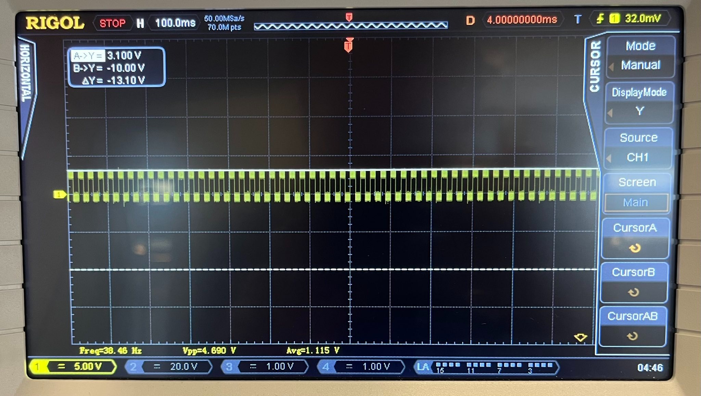
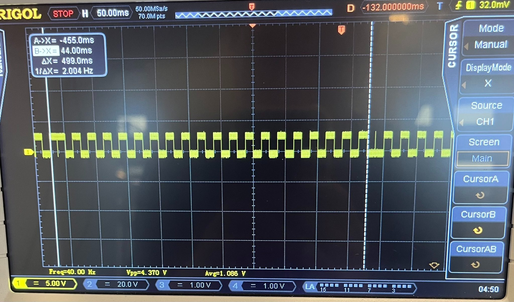
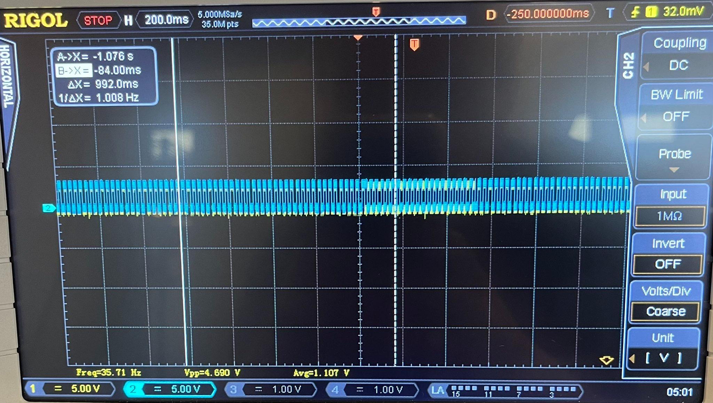

# 7/10/2022 LCD investigations

LCD rotates through the N, H, B, and P icons displaying on the screen. 5 pins on the LCD screen; defining these as 0-5 where pin 0 is the top RH one when the screen is facing up and the pins are on the left. 

scoping each pin on the original device: 

- pin 0: 13ms pulses +3V all identical 
- pin 1: 13ms pulses +3V, every 500ms there is a double-wide pulse (25ms which alternates high/low)
- pin 2: 13ms pulses +3V, every 500ms there is a double-wide pulse (25ms which alternates high/low)
... 3,4,5 cursory glance seem to be the same

I think the LED works anywhere from 2-3V probably (or even lower). 2.5V is just VCC of the kinda-drained coin cell. 

I'm guessing the double-length pulses signal the start and stop of each icon displaying -- when the pin voltage is in phase with pin 0, the screen is blank, and when it is out of phase, the icon shows on the screen. 

Soldered a couple wires onto the exposed pins of the LCD I depopulated from the other board - pin 0, 1 and 5 are connected now. 

Scoped pin 0 (probe 2, yellow) and pin 1 (probe 1, blue). It's pretty clear from this that my guess is right -- at about 25% duty cycle the 2 traces are out of phase, which corresponds to the 25% of the time each icon is lit up. (traces below)

Final step -- identifying which pins are which icon: 

- pin 1: B
- pin 2: H
- pin 3: N
- pin 5: P 

Hahaha. Case closed on how the LCD works. 